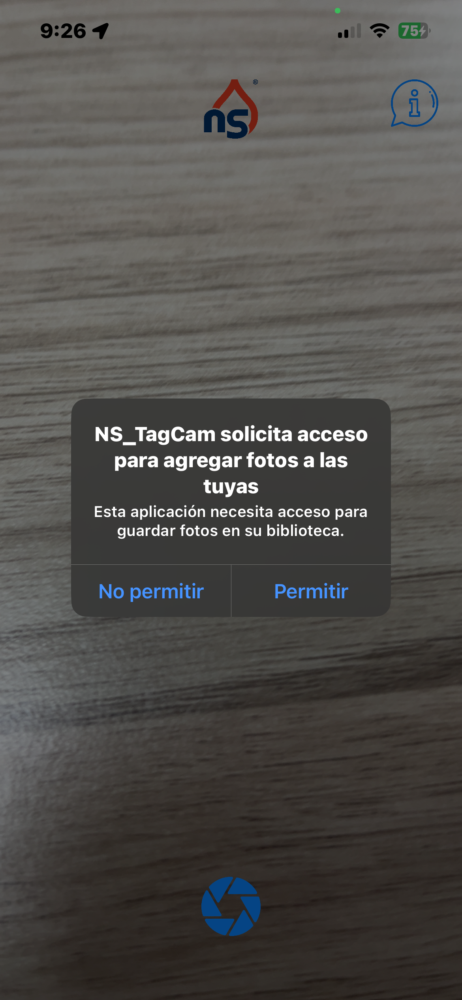
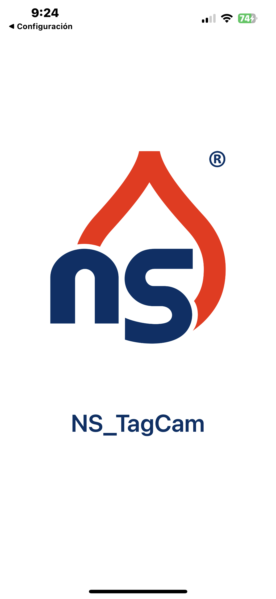

# 📸 NS TagCam

**NS TagCam** es una aplicación iOS de captura de imágenes de grado profesional desarrollada íntegramente en Swift. Está diseñada para inspecciones técnicas, trabajo de campo y levantamiento de evidencias, combinando controles de cámara avanzados con la inserción de metadatos geográficos y marcas de agua en tiempo real.

---

## ✨ Características Principales

### 📷 Interfaz de Cámara Avanzada
- **Controles Manuales**: Ajuste en tiempo real de **ISO** y **Exposición** (EV) mediante deslizadores en la pantalla.
- **Múltiples Lentes y Zoom Dinámico**: Soporte para cambios de lente utilizando la API nativa de `AVFoundation`. Incluye un panel moderno con botones discretos para niveles de zoom (0.5x, 1x, 2x, 3x) que interactúan armónicamente con las capacidades de hardware de cada iPhone (ej. ultra gran angular). También soporta control fluido mediante el gesto de pellizcar (*Pinch-to-Zoom*).
- **Enfoque Intuitivo**: Funcionalidad *Tap-to-Focus* y auto-exposición con feedback visual animado en pantalla.
- **Herramientas de Composición**: Cuadrícula (Grid) activable, control de flash dinámico y transición suave entre cámara frontal y trasera.

### 📍 Telemetría y Etiquetado Geográfico (Watermark)
Cada fotografía capturada es procesada asincrónicamente mediante *Core Graphics* para incrustar una etiqueta visual inalterable con telemetría crítica:
- **Coordenadas GPS**: Latitud y Longitud obtenidas mediante `CoreLocation`.
- **Altitud y Precisión**: Datos exhaustivos sobre la precisión de la señal satelital.
- **Geocodificación Inversa (Reverse Geocoding)**: Integración con `MapKit` para convertir automáticamente las coordenadas brutas en una dirección legible (Calles, ciudades, código postal).
- **Metadatos y Personalización**: Estampado preciso de fecha y hora, junto con la adición de logotipos corporativos.

### 📐 Gestión Sensorial de Orientación Verdadera
A diferencia de las aplicaciones de cámara comunes limitadas por `UIDevice.orientation`, **NS TagCam** integra la lectura del giroscopio a través de `CoreMotion` (`CMMotionManager`). Esto asegura que la orientación del archivo de video y la alineación topográfica de la marca de agua sean perfectas, incluso si el dispositivo tiene bloqueada la rotación a nivel de sistema operativo (*Portrait Orientation Lock*).

## 📸 Galería de la Aplicación

A continuación se presentan capturas reales de la interfaz y los resultados obtenidos con **NS TagCam**:

  
  

  

  

---

## 🛠 Arquitectura Técnica

La base de código sigue un patrón arquitectónico limpio enfocado en la modularización funcional. El gigantesco archivo controlador ha sido factorizado en dominios específicos utilizando **Extensiones de Swift**, lo que garantiza un mantenimiento y escalabilidad excepcionales:

- **`ViewController.swift`**: Define el estado de las propiedades y los componentes de la Interfaz de Usuario (UI) declarados programáticamente (*View Code* puro, sin Storyboards ni XIBs) usando *AutoLayout*.
- **`ViewController+UI.swift`**: Responsable del ensamblaje del árbol de vistas, restricciones, aplicación de efectos de desenfoque (*UIVisualEffectView*) y gestos (*UIGestureRecognizer*).
- **`ViewController+Camera.swift`**: Configura y maneja la arquitectura compleja de `AVCaptureSession`. Gestiona el pipeline de entradas de hardware, el delegado `AVCapturePhotoCaptureDelegate` y el dibujado asíncrono en memoria de la imagen final con la marca de agua.
- **`ViewController+Actions.swift`**: Lógica reactiva e interactividad. Maneja la interpolación suave de zoom, bloqueos de hardware (`lockForConfiguration`), animaciones de interfaz y el motor de *Haptic Feedback*.
- **`ViewController+Location.swift`**: Integración robusta de `CLLocationManager` para métricas en tiempo real.
- **`ViewController+Motion.swift`**: Abstracción del hardware de sensores para el cálculo de los vectores de gravedad físicos.

---

## 🚀 Requisitos del Sistema y Despliegue

- **IDE:** Xcode 14.0 o superior.
- **SDK:** iOS 14.0 o superior.
- **Dispositivo:** Dispositivo físico requerido para funcionalidades completas. El simulador de Xcode carece de soporte nativo para `AVCaptureDevice` (cámaras) y emulación completa de sensores gravitacionales.

### Configuración del `Info.plist`
Para desplegar exitosamente este repositorio, se deben declarar las intenciones de privacidad del usuario en el archivo de configuración:
- `NSCameraUsageDescription`
- `NSLocationWhenInUseUsageDescription`
- `NSPhotoLibraryAddUsageDescription`

---

## 👨‍💻 Autor y Contacto

**NS TagCam** ha sido desarrollado bajo altos estándares de ingeniería de software para plataformas Apple.

- **Desarrollador:** Ing. Elián Hernández Olarte
- **Email de Contacto:** jernelolart@proton.me
- **Website Oficial:** [www.jernelsystems.com](https://www.jernelsystems.com)

*Copyright © JernelSystems. All rights reserved.*
